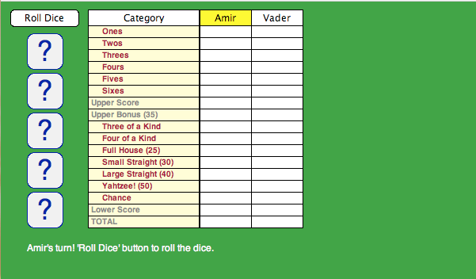
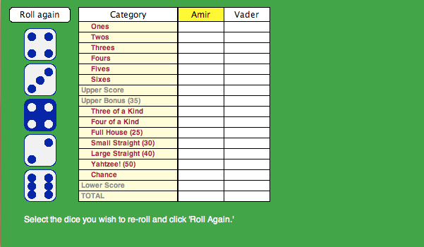
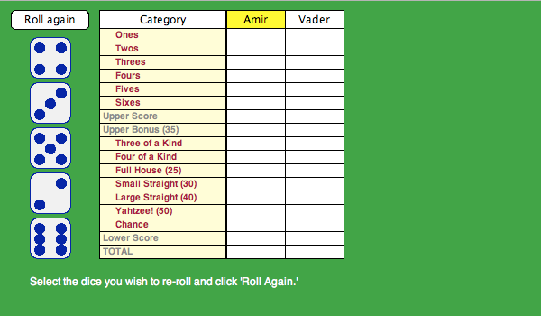
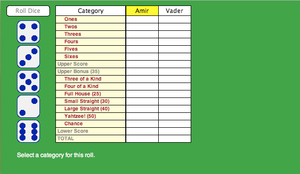
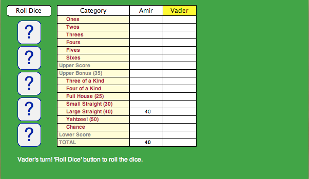

# Yahtzee!!!

### How to play

  1. Enter number of players.
  2. Enter names of each player.
  3. Player rolls dice by clicking 'Roll Dice'. 
  4. Player selects dice to re-roll by clicking the dice. *In the following screenshot, I'm going for a large straight, so I'll re-roll the four to see if I can get a 5.*  
  5. Player selects dice to re-roll again. *I got the large straight! I don't want to re-roll any of my dices so I won't select any and click 'Roll Again.'* 
  6. Choose a category. If the category does not match or if you don't have any matches, you will be assigned 0 points for that category. Every turn must be assigned a category, even if there is no match, so choose wisely which category you wish to scratch. 
  7. Next player's turn. 
  8. Continue until all the rounds are over.
  9. Have fun!
